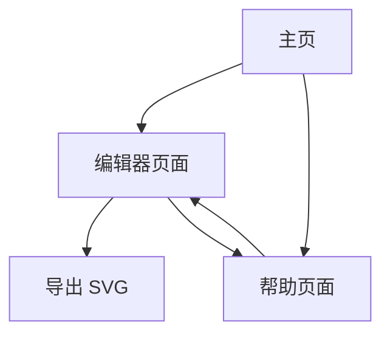

# Mermaid 在线图表导出器 - 产品需求文档

## 1. Product Overview
一个基于 mermaid-cli 的在线图表生成和导出平台，让用户能够通过简单的文本语法创建专业的流程图、时序图等各类图表，并导出为 SVG 格式。
- 解决用户需要快速创建和分享图表的需求，无需安装任何软件即可在浏览器中完成图表的创建、预览和导出。
- 面向开发者、产品经理、技术文档编写者等需要频繁制作图表的专业人士，提供高效便捷的图表制作工具。

## 2. Core Features

### 2.1 Feature Module
我们的 Mermaid 在线导出器包含以下主要页面：
1. **主页**: 产品介绍、功能展示、快速开始按钮
2. **编辑器页面**: 代码编辑区、实时预览区、工具栏、导出功能
3. **帮助页面**: Mermaid 语法说明、示例图表、常见问题

### 2.2 Page Details

| Page Name | Module Name | Feature description |
|-----------|-------------|---------------------|
| 主页 | 产品介绍区 | 展示产品核心价值、主要功能特点，包含醒目的开始使用按钮 |
| 主页 | 功能展示区 | 通过动态示例展示支持的图表类型（流程图、时序图、甘特图等） |
| 主页 | 导航栏 | 提供到编辑器和帮助页面的快速导航链接 |
| 编辑器页面 | 代码编辑器 | 支持 Mermaid 语法高亮、自动补全、错误提示的代码编辑区域 |
| 编辑器页面 | 实时预览区 | 实时渲染用户输入的 Mermaid 代码为可视化图表 |
| 编辑器页面 | 工具栏 | 包含示例模板选择、主题切换、缩放控制、全屏预览等功能 |
| 编辑器页面 | 导出功能 | 提供 SVG 格式导出，支持自定义文件名和下载 |
| 编辑器页面 | 错误处理 | 显示语法错误信息和修复建议 |
| 帮助页面 | 语法指南 | 详细的 Mermaid 语法说明和使用教程 |
| 帮助页面 | 示例库 | 提供各类图表的完整示例代码，用户可一键复制到编辑器 |
| 帮助页面 | 常见问题 | 解答用户在使用过程中可能遇到的问题 |

## 3. Core Process
用户操作流程：
1. 用户访问主页，了解产品功能后点击"开始使用"进入编辑器
2. 在编辑器中输入或选择 Mermaid 代码模板
3. 实时预览区自动渲染图表，用户可调整代码直到满意
4. 使用工具栏功能调整主题、缩放等显示效果
5. 点击导出按钮生成 SVG 文件并下载到本地
6. 如需帮助，可随时访问帮助页面查看语法指南和示例

## 4. User Interface Design
### 4.1 Design Style
- **主色调**: 深蓝色 (#1e40af) 和浅蓝色 (#3b82f6)，体现专业和技术感
- **辅助色**: 白色 (#ffffff) 和浅灰色 (#f8fafc) 作为背景色，绿色 (#10b981) 用于成功状态
- **按钮样式**: 现代化圆角按钮，主要按钮使用渐变效果，悬停时有微妙的阴影变化
- **字体**: 主要使用 Inter 字体，代码区域使用 JetBrains Mono 等宽字体，中文使用系统默认字体
- **布局风格**: 简洁的卡片式布局，左右分栏设计，顶部导航栏固定
- **图标风格**: 使用 Heroicons 或 Lucide 等现代线性图标库

### 4.2 Page Design Overview

| Page Name | Module Name | UI Elements |
|-----------|-------------|-------------|
| 主页 | 产品介绍区 | 大标题使用 48px Inter 字体，渐变背景，居中布局，CTA 按钮使用蓝色渐变 |
| 主页 | 功能展示区 | 3列网格布局，每个功能卡片包含图标、标题和描述，悬停效果 |
| 编辑器页面 | 代码编辑器 | 左侧占 50% 宽度，深色主题，Monaco Editor 组件，语法高亮 |
| 编辑器页面 | 实时预览区 | 右侧占 50% 宽度，白色背景，居中显示图表，支持缩放 |
| 编辑器页面 | 工具栏 | 顶部固定，包含图标按钮，下拉菜单使用卡片样式 |
| 帮助页面 | 语法指南 | 左侧导航菜单，右侧内容区，代码块使用深色背景 |

### 4.3 Responsiveness
产品采用桌面优先的响应式设计，在移动设备上编辑器将改为上下布局，确保在平板和手机上也能正常使用。支持触摸操作优化，包括手势缩放和滑动导航。