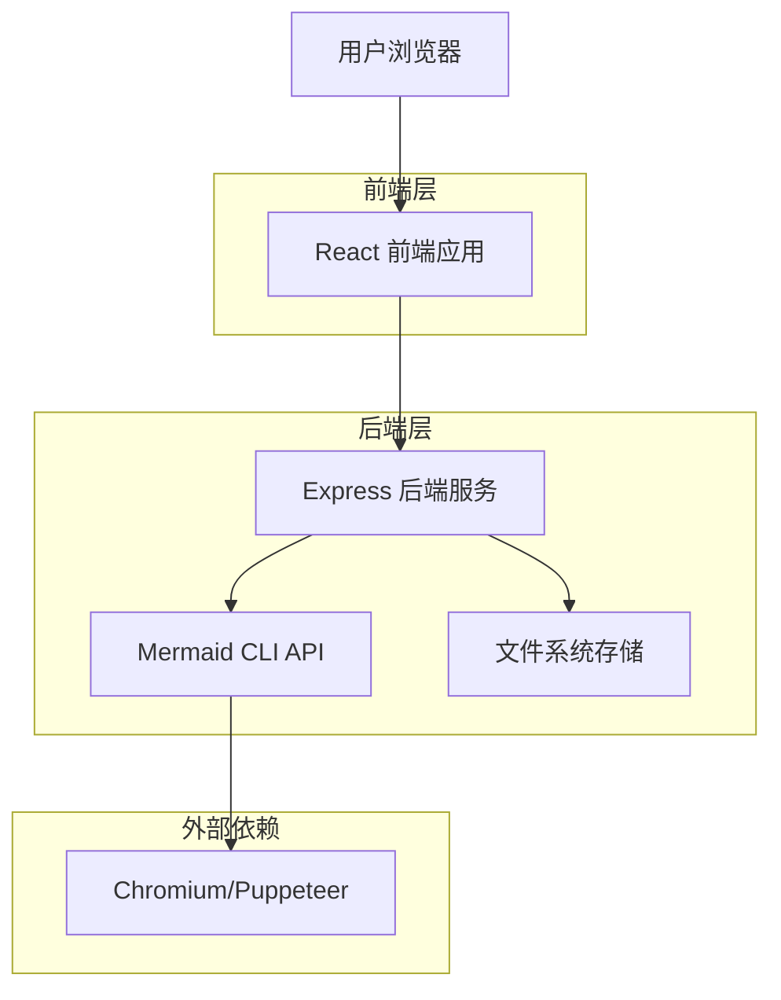
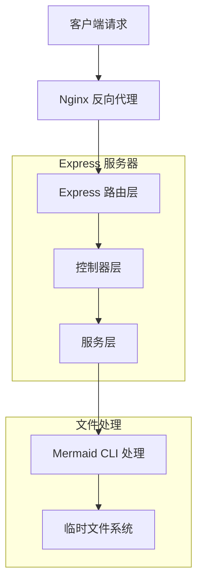

# Mermaid 在线图表导出器 - 技术架构文档

## 1. Architecture design



## 2. Technology Description
- 前端: React@18 + TypeScript + Tailwind CSS + Vite + Monaco Editor
- 后端: Node.js + Express@4 + @mermaid-js/mermaid-cli
- 部署: Docker + Nginx + PM2

## 3. Route definitions

| Route | Purpose |
|-------|---------|
| / | 主页，展示产品介绍和功能特点 |
| /editor | 编辑器页面，提供 Mermaid 代码编辑和实时预览功能 |
| /help | 帮助页面，包含语法指南和示例库 |
| /api/export | API 接口，处理 Mermaid 代码转换为 SVG |

## 4. API definitions

### 4.1 Core API

Mermaid 图表导出相关
```
POST /api/export
```

Request:
| Param Name | Param Type | isRequired | Description |
|------------|------------|------------|-------------|
| mermaidCode | string | true | Mermaid 格式的图表代码 |
| theme | string | false | 图表主题 (default, dark, forest, neutral) |
| backgroundColor | string | false | 背景颜色，默认为 transparent |
| width | number | false | 输出图片宽度 |
| height | number | false | 输出图片高度 |

Response:
| Param Name | Param Type | Description |
|------------|------------|-------------|
| success | boolean | 请求是否成功 |
| svgContent | string | 生成的 SVG 内容 |
| error | string | 错误信息（如果有） |

Example Request:
```json
{
  "mermaidCode": "graph TD\n    A[开始] --> B[处理]\n    B --> C[结束]",
  "theme": "default",
  "backgroundColor": "transparent"
}
```

Example Response:
```json
{
  "success": true,
  "svgContent": "<svg xmlns=\"http://www.w3.org/2000/svg\"...></svg>"
}
```

## 5. Server architecture diagram



## 6. Data model

### 6.1 Data model definition
由于本项目主要是无状态的图表生成服务，不需要持久化存储用户数据，因此不涉及复杂的数据模型设计。主要的数据流转包括：

- 用户输入的 Mermaid 代码（临时存储）
- 生成的 SVG 文件（临时存储后返回给用户）
- 配置选项（主题、尺寸等）

### 6.2 Data Definition Language
本项目不需要数据库，所有数据处理都在内存中完成。如果未来需要添加用户系统或图表保存功能，可以考虑使用 SQLite 或 PostgreSQL。

临时文件存储结构：
```
/tmp/mermaid-exports/
├── input-{timestamp}-{random}.mmd    # 临时输入文件
└── output-{timestamp}-{random}.svg   # 临时输出文件
```

文件清理策略：
- 每次处理完成后立即删除临时文件
- 定时任务清理超过 1 小时的遗留文件